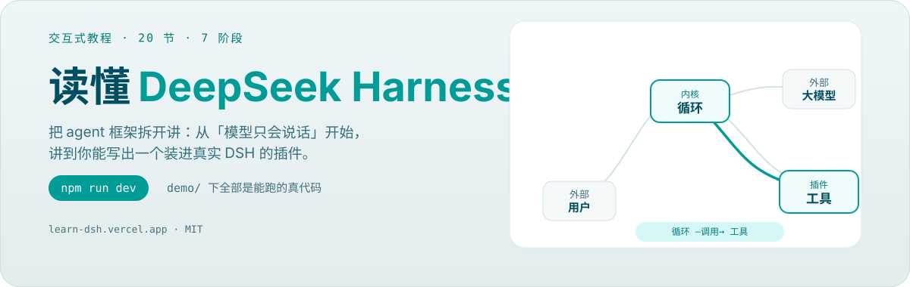
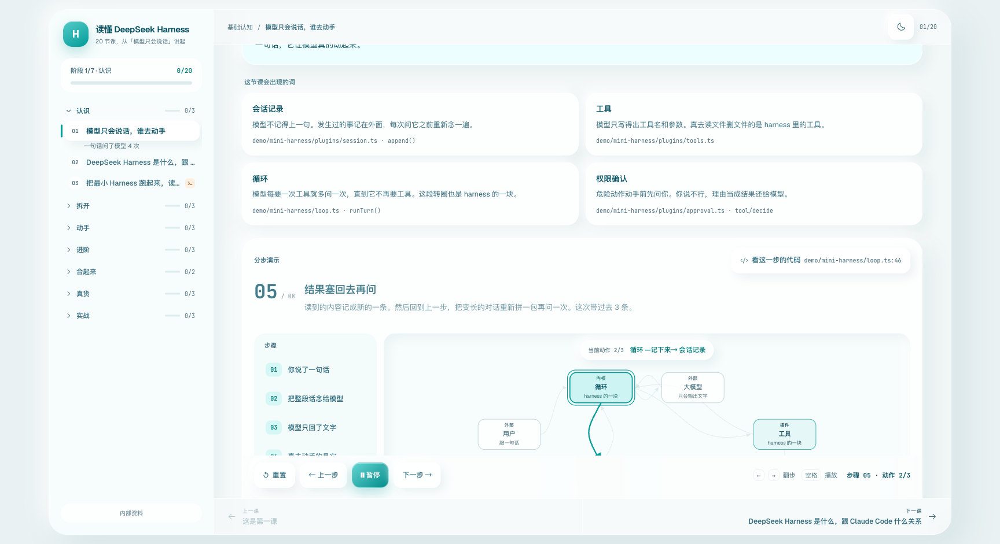

<p align="center">
  <a href="https://learn-dsh.vercel.app">
    
  </a>
</p>

<p align="center">
  <a href="https://learn-dsh.vercel.app"><b>在线版</b></a> ·
  <a href="#课程地图">课程地图</a> ·
  <a href="#本地跑起来">本地运行</a> ·
  <a href="./demo/mini-harness/README.md">demo 说明</a>
</p>

<p align="center">
  <a href="https://github.com/NanmiCoder/learn-deepseek-harness/actions/workflows/deploy.yml"></a>
  <a href="./LICENSE"></a>
</p>

<p align="center">
  
</p>

## 这是什么

一个交互式教程工作台，把 DeepSeek Harness（DSH）是怎么搭起来的讲清楚。写给会写代码、但没做过 agent 框架的人：不需要先懂插件系统、依赖注入、事件总线，从「大模型只会说话」讲起。

读完应该能做到三件事：

- 说清 DeepSeek Harness 是什么、和 Claude Code 什么关系
- 照着写出一个能跑的插件
- 插件没生效时，知道去哪儿查

## 课程地图

20 节，分 7 个阶段。🔧 = 需要打开终端动手的课。

| 阶段 | 课程 | 读完能做什么 |
|---|---|---|
| **认识** | 01 模型只会说话，谁去动手 · 02 DSH 是什么，跟 Claude Code 什么关系 · 03 把最小 Harness 跑起来 🔧 | 分得清零件库和产品，跑过一遍真实输出 |
| **拆开** | 04 一次对话流过哪几块 · 05 一切皆插件 · 06 内核只做三件事 | 改功能知道开哪个文件 |
| **动手** | 07 写一个插件，给模型加一个工具 🔧 · 08 插件没生效，怎么查 🔧 · 09 工具描述怎么写 | 亲手写出能跑的插件，会排查 |
| **进阶** | 10 历史越滚越长怎么办 · 11 工具报错、模型抽风、循环停不下来 · 12 危险动作怎么拦 | 知道上下文、失败、审批分别怎么兜 |
| **合起来** | 13 一次运行留下了什么 · 14 子 Agent 为什么要自己开一份日志 | 读得懂会话日志，分得清三个会话 |
| **真货** | 15 真实 DSH 的骨架 · 16 一个命令下去 agent 怎么被装出来 · 17 循环不是中心 | 看清真实骨架，知道 demo 走到哪为止 |
| **实战** | 18 从 demo 插件到真实 DSH 插件 · 19 host 面的三条接缝 · 20 一个包两个入口 🔧 | 写一个能真的装进 DSH 的插件 |

课程顺序以 [`src/lessons/index.ts`](./src/lessons/index.ts) 为准。

## 本地跑起来

```bash
npm install
npm run dev
```

打开 <http://localhost:5173>。左边是课程目录和进度，右边是工作台：每节课按「是什么 → 术语 → 分步演示 → 容易想错的地方 → 完成检查」走，分步演示支持键盘 `←` `→` 翻步、空格播放暂停。

| 命令 | 干什么 |
|---|---|
| `npm run dev` | 开发服务器 |
| `npm run demo` | 跑一遍最小 Harness，看真实输出 |
| `npm run build` | 类型检查 + 打包到 `dist/` |
| `npm run typecheck` | 只做类型检查（网页 + demo） |
| `npm run check` | 课程数据体检，见下 |

## 教程里的代码从哪来

全部来自 `demo/` 下能跑的代码，两处：

- [`demo/mini-harness/`](./demo/mini-harness/) —— 一个能跑的最小 Harness，和真实的 DeepSeek Harness **结构同构，规模不同**：一样的插件模型、服务与依赖、环绕式拦截、事件日志派生历史。差的是规模，不是形状。
- [`demo/dsh-plugin-example/`](./demo/dsh-plugin-example/) —— 一个能装进真实 DSH 的最小插件，实战层三节的代码从这儿来。

```bash
npm run demo
```

跑一下就能看到完整过程：插件排队等依赖、装配、模型要工具、工具执行、危险动作被拦、拒绝理由回灌给模型、插件被拆时自动清理。**教程里「运行记录」面板显示的内容，就是这条命令的真实输出。**

## 怎么加一节课

每节课是一份纯数据，不用写组件：

1. 在 `src/lessons/` 下加一个文件，导出一个符合 `Lesson` 类型的对象
2. 在 `src/lessons/index.ts` 里 import 进来，按顺序放进 `lessons` 数组
3. 跑 `npm run check`

`Lesson` 的字段定义写在 [`src/tutorial/types.ts`](./src/tutorial/types.ts) 的注释里。

`npm run check` 查的是类型检查管不到的东西：动画点亮的节点和连线在图里是不是真的存在、有没有画了却没点亮过的死线、答案下标有没有越界、标题说明有没有长到画不下；另有一项内容边界的硬拦——课程里不允许出现 DSH 内测项目的内部实现符号（路径、私有类型、内部字段名），面向插件开发者的公开扩展接口（包名、manifest 字段、插件形状）可以出现。有错误退出码 1。

<details>
<summary><b>写作约定</b>（加课、改文案前先读）</summary>

分两层：**判据**决定什么算问题，**手法**决定怎么改。判据两条不能绕，手法八条是常犯的具体毛病。

### 判据

**1. 读者视角测试。这是第一把尺，其他条都是从它派生的。**

> 只拿着这份教程的读者，能不能解析每一个指代、验证每一条断言？

不能，就是问题。这把尺能判真假，不靠语感。下面这些一律不合格：

- 引用读者拿不到的东西：「真实运行快照」「内部日志显示」——他核不了。
- 「正如我们前面提到的」：指代靠的是写的人的顺序，不是读的人的顺序。读者可能是从侧边栏直接点进来的。
- 「这里我们先简化一下」「本节不看它的源码」：叙述作者的取舍过程，不是读者要学的事实。
- 「值得注意的是」：替读者标重点，这是评审视角不是读者视角。
- 替自己的写法辩护：「这不是泛泛的解耦」「不讲代价就成软文了」——这是在跟一个不在场的人说话。

**一个例外，别误杀**：`steps[].detail` 就是分步讲解，「先 X，再 Y」是它的正当写法。要删的是复述完流程什么都没多说的句子——把它砍掉，看读者是否损失信息。

**2. 完整命题规则。这是刹车，比第 1 条优先。**

动手改之前，先把这段话的每一个命题列出来，逐条保住：

- 行为主体与动作
- 条件、时序、顺序
- 模态：必须 / 可以 / 绝不
- 否定性保证与例外
- 归属、副作用、失败模式、后果

> 只有当每一个事实子句都活下来、并且结果更清楚时，删形容词和叙述才算改进。**单纯字数变少不是改进。**

命题可以换地方安家（同一节课里同屏可达就行），但不能消失。四个必须避开的陷阱：

- 把「必须」改成了「可以」
- 把假设写成了已实现的特性
- 删掉了一个真事实
- 丢了出处和依据

**改完必须回筛一遍。**这不是建议是流程——上一轮有人对自己 55 条改写做完整命题回筛，查出 14 处违规，命中率 25%。四条里就有一条出问题，你也一样。回筛重点看这三种，实测最高频：

1. **看着像套话的那句，先确认它不是锚点。**「前一台是 Claude Code，后一台是 DeepSeek Harness」读着像收尾套话，删起来毫无心理负担——但它是整段对照里唯一把两台电脑接到两个产品上的地方，删完读者不知道哪台是哪个。
2. **删空话时最容易造假，因为空出来的位置让人手痒。**为了替换「循环是 Harness 的心跳」这个空比喻，有人写出了「这三行 `ctx.get` 就是它跟外界的全部接口」——是假的，`loop.ts` 还有五处 `ctx.emit` 和第四个 `ctx.get`。**空出来的位置不必填满，允许那里就是空的。**
3. **术语的默认处置是补定义，不是删掉。**判据是这个词有没有指称对象：有（MCP、热插拔）就保留加一句定义，读者以后还会在别处遇到；没有（数据流、链路）才换掉。**查无此物的要换掉，不是补定义**——先确认它真的存在，再决定保留。

### 手法

**3. 代码只能来自 `demo/` 下能跑的东西。**写 `demo/mini-harness/kernel.ts:59` 之前先打开文件确认行号，代码原样复制，最多 14 行。

**4. 运行记录只能来自 `npm run demo` 的真实输出。**不要编。这是整套教程唯一的可信度来源，为一节课破例，前面所有节的信用一起打折。

**5. 比喻要过「删除测试」。**写完把它删掉再读一遍正文，理解难度没上升就不要写。留下的还得满足：比喻里说是 A 干的事正文里就不能是 B 干的；要罩得住这一节最难的那两步；一个本体词在整套教程里只能指一样东西。**没有合格的比喻时留空 `analogy`，改写 `positioning` 直接说定位——凑一个比喻出来比不写更糟。**

**6. 同一份清单在一节课里只能完整出现一次。**第二次出现必须是新增信息，不是换个说法。`oneLiner` 和 `analogy` 相邻渲染，最容易撞。

**7. 每一句判断句，后面要么跟一个 `npm run demo` 里看得到的现象，要么跟一个具体文件行号，要么删掉。**「任何 X 都……」「换掉哪个都不影响……」「可追踪也可重放」这类都算判断句。

**8. 一句话只讲一件事，超过 30 字就断句。第一次出现的术语先用大白话解释再用，英文缩写要给全称。**

**9. 不写营销口号、反问式标题、装饰性英文、emoji。**禁用词表，出现即待改：

> 归根结底 · 本质上 · 换句话说 · 值得注意的是 · 简单来说 · 精髓 · 魅力所在 · 让我们 · 不是白来的 · 形成闭环 · 收束 · 固化 · 赋能 · 打通 · 沉淀 · 承载 · 「这就是 X」作为段落结尾 · 「不是 X，而是 Y」连用超过一次 · 「自己不干活，只 X」

再加一条句式约束：**同一段里不允许出现三个及以上结构相同的并列短句。**

**10. 只讲好处不讲代价的内容不要写，那是软文不是教程。**每个「好处」配一个「代价」。第 03 节的「代价是什么」四条是现成的模板。

### 答错反馈单独说一句

`QuizItem.wrongExplains` 给每个错误选项写一句专属反驳，下标和 `options` 对齐。答错那一刻是唯一能确诊读者哪儿想岔了的时机，「这个不对，回去再看一遍」是判分不是教学。不写会退回通用提示，尽量别省。

</details>

## 结构

```
demo/mini-harness/  自己写的最小 Harness，教程里所有代码都来自这里
src/
  lessons/          每节课的数据，一个文件一节
  tutorial/
    types.ts        课程数据契约
    LessonView.tsx  工作台渲染器，所有课共用
    LessonControls  播放控制条
    useLessonPlayer 分步状态与键盘快捷键
  components/
    StageDiagram    分步动画，按步点亮节点和连线
    RunLog          运行记录，走过的步骤会留在上面
    CodePanel       代码与解释
    Quiz            完成检查
scripts/
  check-lessons.ts  课程数据体检
```

## License

[MIT](./LICENSE)
